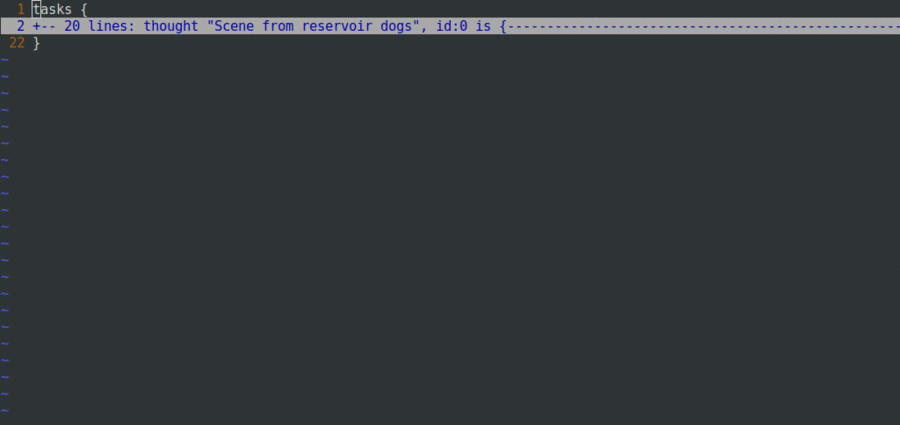
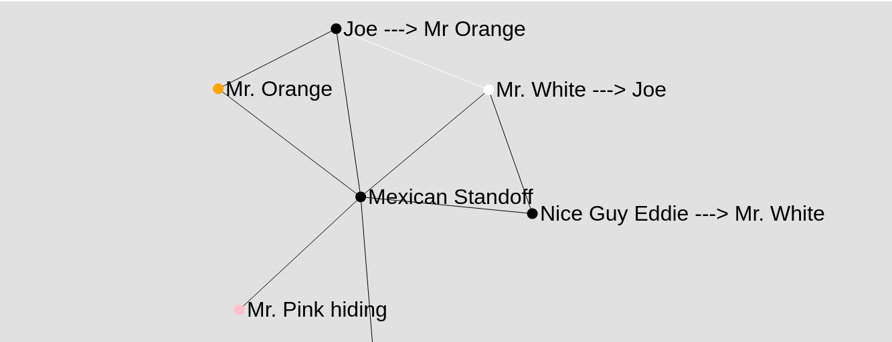
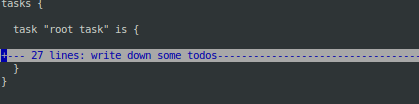

# vim-mind-mapper
`vim` based command line mind mapping tool
Create and manipulate complex mind maps using a simple and powerful `Groovy DSL`,
and `vim`, which helps in lesser context switches of brain, and hence lesser disturbance
Lets write a simple map of a scene from reservoir dogs as a mind map:
```
tasks {
  thought "Scene from reservoir dogs" is {

    //We can add any kind of property(string, list, range, boolean, integer, etc) in any item,
    and comments too!
    thought "Mr Orange is bleeding", playedBy:"Tim Roth"
    thought "Joe thinks Mr. Orange is the rat" is {
      thought "Joe Points the gun at Mr. Orange" is {
        thought "Mr. White points the gun at Joe", playedBy:"Harvey Keitel" is {
          point "because" is {
            point "Mr White has been a good friend to Orange", isAFact:true
            point "So, White doesnt want Orange killed by Joe"
            point "Mr White believes that Mr Blonde is crazy", isMyOpinion:true
          }
          thought "Nice Guy Eddie points the gun at Mr. White" is {
            point "because" is {
              point "Nice Guy Eddie is Joe's son."
            }
          }
        }
      }
    }
    idea "Let's not spoil a classic for those who havent seen it"
  }
}
```
This is always re-indented and folded when viewed in vim.


This gets converted to:


So far, it was all hierarchical, we need a graph:
```

tasks {
  idea "Mexican Standoff", id:0 is {
    point "Mr. Orange", color:"orange", id:1
    point "Joe ---> Mr Orange", id:2, connectTo:1
    point "Mr. White ---> Joe", color:"white", id:3, connectTo:2
    point "Nice Guy Eddie ---> Mr. White", id:4, connectTo:3
    point "Mr. Pink hiding", id:5, color:"pink"
  }
}
```
which gives:


### Installation
#### Docker (Preferred)
```
docker run -p 8084:8084 -p 8083:8083 -v $(pwd):/home -it anuragntl/vimmindmap:0.1.1
```
It will start `ttyd` server on `port 8084` and tasks can be edited by navigating to:
```
http://localhost:8084/
```
in the browser.

#### Direct
##### Requirements:
* python
* node js (will auto install if `snap` is present)
* groovy (will auto install if `snap` is present)
* vim (will auto install if `snap` is present)

Clone `vim-mind-mapper`:
```
$ git clone https://github.com/AnuragNtl/vim-mind-mapper.git
```

Install:
```
$ cd vim-mind-mapper
$ sudo ./install
```

### Usage:
On running task with `docker`, navigate to `http://localhost:8084`, which will present a menu.
Or on running directly, the same will be displayed.
```
$ task
```
`task file` and `options` can be passed as cmdline arguments.

Choose option `new_plain_task_file` to create a new mind map, or `read_tasks` to open existing encrypted task file.
vim will open with the editable mind map and graph spec.
By default lines are folded, which can be toggled with vim's default <kbd>Z</kbd>+<kbd>A</kbd>, closed with <kbd>Z</kbd>+<kbd>C</kbd>, 
read with <kbd>Z</kbd>+<kbd>R</kbd> :


Edit the task and save the file with vim's <kbd>:</kbd>+<kbd>w</kbd>.
Once vim is closed, task file is encrypted with `AES` using key as `SHA256` of password entered, and then `base64`ed and this is decrypted using same process in reverse when read using `task` command.

